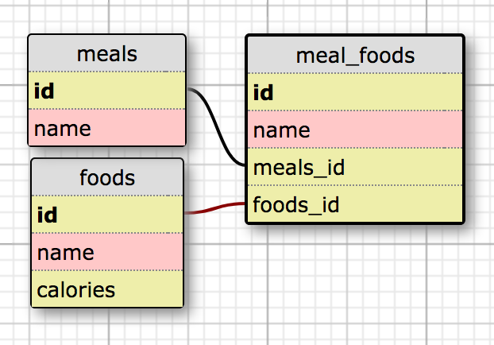

# Quantified Self API (Rails)
This is a Rails-based API whose ostensible purpose is to interface with the [Quantified Self Front End](http://quantified-self.surge.sh), which is a calorie tracking application.

The Quantified Self API also allows a user or application to post and consume data for foods and meals, and is currently hosted on AWS at http://quantified-self-rails-dev.us-west-2.elasticbeanstalk.com/.  

 Local setup instructions and information regarding each of the available endpoints, are detailed below.

___
### Setup
To run this application locally, first clone the repository from the following location:

```
$ git clone https://github.com/agpiermarini/quantified-self-rails
```

From the application directory, run the following commands to install and update all gem dependencies:

```
$ bundle
$ bundle update
```

Next, run the following commands to initialize the database:

```
$ rake db:{create,migrate}
```

Then spin up a server:

```
$ rails s
```

___
### Contribute

Fork the [repository](https://github.com/agpiermarini/quantified-self-rails) if you would like to contribute to this project. Pull requests will be considered in kind, but please note that contributions must adhere to a test-driven, rebase workflow.

This project uses the RSpec test framework. Run tests using the standard `$ rspec` command.

#### Database Schema



#### Current Contributors
[Andrew Piermarini](http://www.github.com/agpiermarini)

### Versions
Ruby 2.4.4  
Rails 5.1.6
ActiveRecord 5.1.6
RSpec-Rails 3.7.2


___
### Endpoints

Production Base URL: http://quantified-self-rails-dev.us-west-2.elasticbeanstalk.com
Local Base URL:       http://localhost:3000

#### Food Endpoints

**GET /api/v1/foods**
Return all foods in the databse

Request URL
```
/api/v1/foods
```

Response Body
```
[
  {
    id: 1,
    name: "Sashimi",
    calories: 300
  },
  {
    id: 2,
    name: "Bahn Mi",
    calories: 650
  },
  {
    id: 3,
    name: "Khao Soi",
    calories: 700
  },
  {...}
]
```
Response Code
```
200
```


**GET /api/v1/foods/:id**
Return food corresponding to :id

Request URL
```
/api/v1/foods/:id
```

Response Body
```
{
  id: 1,
  name: "Pad Ga Pow Moo Kai Dow",
  calories: 800
}
```

Response Code
```
200
```


**POST /api/v1/foods**
Create a new food item in the database

Request URL
```
/api/v1/foods
```

Parameters Format
_All parameters required_
```
{ food { "name": "Tonkatsu Ramen", "calories": 950 } }
```

Response Body
```
{
  id: 1,
  name: "Pad Ga Pow Moo Kai Dow",
  calories: 800
}
```

Response Code
```
200
```


**PATCH /api/v1/foods/:id**
Edit food corresponding to :id

Request URL
```
/api/v1/foods/:id
```

Parameters Format
_All parameters required_
```
{ food { "name": "Miso Ramen", "calories": 950 } }
```

Response Body
```
{
  id: 1,
  name: "Pad Ga Pow Moo Kai Dow",
  calories: 800
}
```

Response Code
```
200
```


**DELETE /api/v1/foods/:id**
Delete food corresponding to :id

Request URL
```
/api/v1/foods/:id
```

Response Code
```
204
```


##### Meal Endpoints

**GET /api/v1/meals**
Return all meals along with their associated foods

Request URL
```
/api/v1/meals
```

Response Body
```
[
    {
        "id": 1,
        "name": "Breakfast",
        "foods": [
            {
                "id": 1,
                "name": "Mango",
                "calories": 150
            },
            {
                "id": 6,
                "name": "Yogurt",
                "calories": 550
            },
            {
                "id": 12,
                "name": "Coffee",
                "calories": 50
            }
        ]
    },
    {
        "id": 2,
        "name": "Lunch",
        "foods": [
            {
                "id": 1,
                "name": "Geng Kheaw Wan Gai",
                "calories": 600
            },
            {
                "id": 9,
                "name": "Som Tam,
                "calories": 200
            }
        ]
    },
    {...}
  ]
```

Response Code
```
200
```


**GET /api/v1/meals/:meal_id/foods**
Return all foods associated with meal corresponding to :meal_id

Request URL
```
/api/v1/meals/:meal_id/foods
```

Response Body
```
[
  {
      "id": 1,
      "name": "Mango",
      "calories": 150
  },
  {
      "id": 6,
      "name": "Yogurt",
      "calories": 550
  },
  {
      "id": 12,
      "name": "Coffee",
      "calories": 50
  }
]
```

Response Code
```
200
```


**POST /api/v1/meals/:meal_id/foods/:food_id**
Add food corresponding to :food_id to meal corresponding to :meal_id

Request URL
```
/api/v1/meals/:meal_id/foods/:food_id
```

Response Body
```
{
    "message": "Successfully added <FOOD NAME> to <MEAL NAME>"
}
```

Response Code
```
201
```

**DELETE /api/v1/meals/:meal_id/foods/:food_id**
Remove food corresponding to :food_id from meal corresponding to :meal_id

Request URL
```
/api/v1/meals/:meal_id/foods/:food_id
```

Response Body
```
{
    "message": "Successfully removed <FOOD NAME> from <MEAL NAME>"
}
```

Response Code
```
200
```
